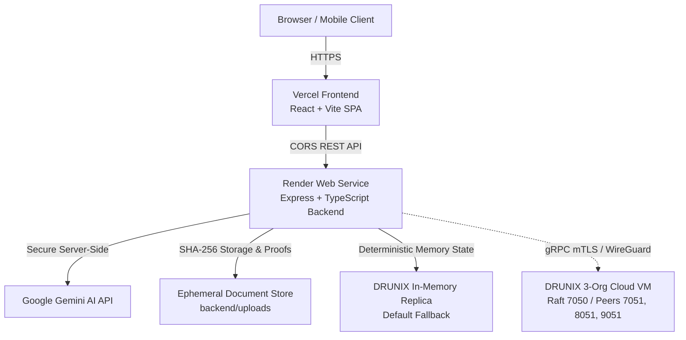

# InvoiceNet — DRUNIX MSME Invoice Financing Platform

[](https://github.com/npci/drunix)
[](https://github.com/npci/drunix)
[]()
[](LICENSE)

> **Unlocking ₹20 Lakh Crore in trapped MSME receivables through multi-party cryptographic verification on DRUNIX.**

---

### Quick Links
- 📘 [Full Architecture & Project Plan](docs/README.md)
- ⚙️ [DRUNIX Go Smart Contract](chaincode/invoicenet.go)
- 🌐 [DRUNIX 3-Org Topology Configuration](drunix-network/docker-compose-3org.yaml)
- 🚀 [Backend Express & DLT Gateway](backend/src/server.ts)
- 💻 [Frontend Next/React Application](frontend/src/App.tsx)

---

### Quick Start (Dev Environment)

#### 1. Backend Server (Port 5000):
```bash
cd backend
npm install
npm run dev
```

#### 2. Frontend Interface (Port 3000):
```bash
cd frontend
npm install
npm run dev
```

Visit **`http://localhost:3000`** in your browser.

---

## 🛡️ Enterprise AI Invoice Risk Engine

InvoiceNet incorporates an explainable, deterministic AI-powered invoice risk assessment engine combined with Google Gemini LLM synthesis. It evaluates invoice reliability, identifies fraud and financial risks, and provides actionable recommendations before financing occurs on the DRUNIX distributed ledger.

### 1. Risk Scoring Methodology

The risk engine generates a deterministic score from **0 to 100** categorized into four distinct underwriting brackets:

| Score Range | Risk Category | Underwriting Action | Description |
| :--- | :--- | :--- | :--- |
| **0 – 29** | **Low Risk** | Auto-Approve / Fast-Track | Prime commercial receivable; consistent ledger verification; verified PO and GSTIN. |
| **30 – 59** | **Medium Risk** | Standard Manual Review | Moderate variance, extended payment tenor, unlinked PO, or missing historical depth. |
| **60 – 79** | **High Risk** | Enhanced Due Diligence | Arithmetic mismatch, material PO value variance (>5%), or overdue maturity. |
| **80 – 100** | **Critical Risk** | Immediate Financing Hold | Duplicate invoice number, duplicate document SHA-256 hash, or commercial date paradox. |

#### Deterministic Risk Factors & Scoring Weights

* **Duplicate Invoice Number Collision (`+45 pts, CRITICAL`)**: Matches existing invoice reference across any on-chain invoice.
* **Duplicate Cryptographic Document Hash (`+45 pts, CRITICAL`)**: Matches SHA-256 hash of an existing invoice attachment (prevents double-pledging/double-financing).
* **Arithmetic Inconsistency (`+25 pts, HIGH`)**: Subtotal + Tax $\neq$ Total Amount (discrepancy $> ₹1.00$).
* **Purchase Order Discrepancy (`+20 pts HIGH` / `+15 pts MEDIUM`)**: Invoice amount deviates by $>5\%$ from corporate ERP PO, or unverified PO reference.
* **Missing or Malformed Fields (`+20 pts, HIGH`)**: Missing invoice number, or malformed commercial date strings.
* **Commercial Date Paradox (`+20 pts, HIGH`)**: Payment due date is earlier than issuance date.
* **Abnormally Extended Tenor (`+15 pts, MEDIUM`)**: Credit terms exceeding 180 days (violating statutory MSMEDA 45-day norms).
* **Statistical Volume Outlier (`+20 pts HIGH` / `+15 pts MEDIUM`)**: Invoice amount $>3.5\times$ or $>2.0\times$ customary supplier baseline (only evaluated when $\ge 2$ historical invoices exist).
* **Overdue Maturity (`+20 pts HIGH` / `+15 pts MEDIUM`)**: Unsettled invoice past maturity date ($>30$ days or $\le 30$ days).
* **Supplier Identity Inconsistencies (`+15 pts, MEDIUM`)**: Invalid GSTIN checksum or state code mismatch.
* **Cryptographic Endorsement Credit (`-10 pts, MITIGANT`)**: Direct on-chain buyer acceptance (`BuyerMSP` verified signature) reduces risk.

#### Missing Evidence vs. Detected Risk Policy
In accordance with fintech compliance standards, **an invoice is never penalized for unavailable historical data**. When a new supplier lacks prior transaction volume or when an invoice is unlinked to an ERP PO:
* No score penalty is levied.
* The limitation is explicitly logged in `dataLimitations`.
* The assessment confidence score is adjusted to reflect data visibility.

---

### 2. Google Gemini AI Explanations

The risk engine uses Google Gemini via `GEMINI_API_KEY` to synthesize deterministic findings into clear, structured, professional underwriting reports.

* **Schema Validation**: All Gemini responses are validated against a strict Zod schema (`summary`, `keyConcerns`, `supportingEvidence`, `recommendedReviewActions`, `limitations`).
* **Deterministic Guardrails**: The LLM explains the calculated score—it cannot modify or hallucinate the numerical score.
* **Prompt Injection Defense**: Invoice text fields and notes are sanitized and quarantined to prevent instruction override.
* **Offline Fallback**: If the Gemini API is unreachable, rate-limited, or returns non-conforming JSON, the engine falls back to deterministic rule synthesis without failing the assessment.

#### Limitations of AI-Generated Explanations
* AI explanations are contextual syntheses of deterministic signals and on-chain records; they do not constitute legal or formal credit ratings.
* Suppliers are never labeled fraudulent solely based on an AI score; high/critical scores indicate areas requiring human review.
* Gemini explanations reflect the state of available ledger data and extraction confidence at the time of assessment.

---

### 3. REST API Endpoints

All risk routes require role-aware authentication headers (`x-user-role`, `x-user-org`, `x-user-id`).

| Method | Endpoint | Description | Permitted Roles |
| :--- | :--- | :--- | :--- |
| `POST` | `/api/risk/assess/:invoiceId` | Run on-chain risk assessment on an invoice | `SUPPLIER`, `BUYER`, `FINANCIER` |
| `GET` | `/api/risk/assessments/:invoiceId` | Retrieve cached or latest assessment for an invoice | `SUPPLIER`, `BUYER`, `FINANCIER`, `EXPLORER` |
| `GET` | `/api/risk/dashboard` | Get consortium portfolio risk metrics, brackets, and factors | `FINANCIER`, `EXPLORER`, `BUYER`, `SUPPLIER` |
| `POST` | `/api/risk/assess-document` | Pre-commit risk assessment on extracted document metadata | `SUPPLIER`, `BUYER`, `FINANCIER` |
| `GET` | `/api/risk/assessments` | List risk assessments with category and status filters | `FINANCIER`, `EXPLORER`, `BUYER`, `SUPPLIER` |
| `GET` | `/api/risk/config` | Get scoring thresholds, weightings, and Gemini status | All authenticated users |

---

### 4. Environment Variables

Configure in `backend/.env`:

```env
PORT=5000
NODE_ENV=development
GEMINI_API_KEY=your_google_gemini_api_key_here
```

> **Security Note**: `GEMINI_API_KEY` is maintained strictly on the backend and is never exposed to the frontend client.

---

### 5. Running the Application & Features

#### Start Backend:
```bash
cd backend
npm install
npm run dev
```

#### Start Frontend:
```bash
cd frontend
npm install
npm run dev
```

#### Accessing Risk Features in UI:
1. **Risk Dashboard**: Select **Financier** role $\rightarrow$ Click **"AI Risk Engine"** in the top navigation bar to view portfolio risk breakdown, score dials, category filters, and detailed factor evidence.
2. **Pre-Commit Document Assessment**: Select **Supplier** role $\rightarrow$ Open **"AI Document Intelligence"** $\rightarrow$ Upload an invoice $\rightarrow$ Switch to the **"AI Risk Analysis"** tab to evaluate risk before committing to DRUNIX.
3. **Invoice Details & Proof Modal**: From the **Invoice Registry**, click the **Risk Badge** or **"View Proof & AI Assessment"** on any invoice to inspect score breakdown, cryptographic DRUNIX endorsements, and trigger on-demand re-assessment.

---

### 6. Automated Test Suite

Run the full automated test suite covering both Document Intelligence and the AI Invoice Risk Engine:

```bash
cd backend
npm test
```

#### Test Coverage:
* `TEST 1`: Low-risk invoice (Prime commercial grade, score 0–29)
* `TEST 2`: Medium-risk invoice (Moderate variance, score 30–59)
* `TEST 3`: High-risk invoice (Arithmetic mismatch + PO variance, score 60–79)
* `TEST 4`: Critical-risk invoice (Double financing + date paradox, score 80–100)
* `TEST 5`: Duplicate invoice reference collision detection (`+45 pts`)
* `TEST 6`: Duplicate document cryptographic SHA-256 hash collision (`+45 pts`)
* `TEST 7`: Arithmetic inconsistency detection (`Subtotal + Tax != Total`)
* `TEST 8`: Purchase order discrepancy detection ($>5\%$ variance against ERP PO)
* `TEST 9`: Missing fields and malformed date detection
* `TEST 10`: Insufficient historical data handling (no unfair penalty)
* `TEST 11`: Gemini API failure and deterministic fallback resilience
* `TEST 12`: Invalid Gemini response rejection via Zod validation
* `TEST 13`: Multi-tenant role isolation and unauthorized access prevention
* `TEST 14`: Risk cache invalidation and reassessment upon DRUNIX ledger mutations

---

## 🤖 Enterprise AI Financial Copilot

InvoiceNet features a role-aware, explainable **AI Financial Copilot** grounded directly on the DRUNIX distributed ledger and the AI Invoice Risk Engine. It enables natural-language financial analysis, payment tracking, risk factor explanations, and ledger verification.

### 1. Architecture & Design Principles

* **Read-Only Advisory Assistant**: The Copilot strictly acts as an intelligence advisor. It cannot execute transactions, approve financing, alter invoice statuses, or mutate database state.
* **Deterministic Tool Grounding**: Queries are executed via a controlled tool-calling architecture. The LLM synthesizes verified facts retrieved through backend tools; it never hallucinates ledger records or payment events.
* **Resilient Dual-Engine Execution**:
  * **Online (Gemini 2.5 Flash)**: Contextual synthesis with natural conversational prose.
  * **Offline (FinTech Reasoner)**: Deterministic rule-based reasoning engine operating locally with 0 external API dependencies.
* **Evidence-Based Answers**: Financial answers provide supporting evidence tagged with verified provenance:
  * 🟢 `DRUNIX ledger data`
  * 🔵 `InvoiceNet application data`
  * 🟣 `AI-generated explanation`
  * 🟡 `Forecast or estimate`

---

### 2. Supported User Roles & Permissions

| Role | Permitted Capabilities & Data Isolation Scope |
| :--- | :--- |
| **`SUPPLIER`** | Inquire about submitted receivables, buyer acceptance status, payment due dates, overdue aging, interest savings vs. traditional factoring, and understand risk assessment scores. Strictly isolated to their own organization's invoices. |
| **`BUYER`** | Review payables awaiting acceptance endorsement, inspect purchase order matching & 3-way reconciliation discrepancies, track payment due dates, and view settlement history. |
| **`FINANCIER`** | Review buyer-endorsed receivables awaiting financing offers, inspect AI risk assessments and factor breakdowns, identify invoices requiring manual review, and evaluate factoring yield benchmarks. Cannot view unendorsed draft invoices from other parties. |
| **`EXPLORER`** *(Auditor)* | Comprehensive consortium audit queries: inspect consensus block height, transaction hashes, document SHA-256 fingerprints, and multi-party endorsement chains across all ledger transactions. |

---

### 3. Controlled Backend Tools (Zod-Validated)

All backend tools validate arguments using Zod schemas and enforce role-based access control and organization-level data isolation on every invocation:

1. `getInvoiceDetails(invoiceIdOrNumber)`: Retrieves authorized invoice metadata, parties, amounts, and dates.
2. `listInvoices(filters)`: Lists authorized invoices filtered by status (`CREATED`, `ACCEPTED`, `FINANCED`, `SETTLED`).
3. `getInvoiceRiskAssessment(invoiceIdOrNumber)`: Retrieves explainable 0–100 risk score, category, factors, and underwriting summary from `InvoiceRiskEngineService`.
4. `getPurchaseOrderMatch(invoiceIdOrNumber)`: Executes 3-way ERP PO reconciliation and calculates percentage variance against approved PO baseline.
5. `getInvoiceLifecycle(invoiceIdOrNumber)`: Returns chronological endorsement timeline, block commits, transaction IDs, and MSP signatures.
6. `getPaymentStatus(invoiceIdOrNumber)`: Evaluates maturity, days remaining, overdue status, payment reference, and settlement dates.
7. `getLedgerProof(invoiceIdOrNumber)`: Verifies cryptographic block numbers, document SHA-256 hashes, and consensus endorsements on DRUNIX.
8. `getFinancingRequests(filters)`: Evaluates financing-eligible receivables and compares DRUNIX 8.5% APR against traditional 22% factoring.
9. `getReceivablesSummary()`: Synthesizes total portfolio volume, overdue counts, maturing counts, and MSME interest savings.
10. `getNetworkMetrics()`: Reports Raft orderer status, block height, and connected peer organizations.

---

### 4. REST API Endpoints

All copilot endpoints require role-aware authentication headers (`x-user-role`, `x-user-org`, `x-user-id`, `x-user-msp`).

| Method | Endpoint | Description |
| :--- | :--- | :--- |
| `POST` | `/api/copilot/chat` | Send a natural-language query and receive grounded answer + evidence cards |
| `GET` | `/api/copilot/suggestions` | Retrieve role-tailored starter prompts |
| `GET` | `/api/copilot/history` | Retrieve session conversation history for the authenticated user |
| `DELETE` | `/api/copilot/history` | Reset / clear active session conversation history |
| `GET` | `/api/copilot/proof/:invoiceId` | Retrieve cryptographic ledger proof for an authorized invoice |

---

### 5. Security & Prompt Injection Defense

* **Never-Trust-Frontend Role Policy**: User roles and organizations are determined strictly from backend-authenticated headers. Client body roles cannot elevate privileges.
* **Prompt Injection Neutralization**: All user messages are sanitized and quarantined. System prompts explicitly instruct the model to ignore instructions embedded in documents or invoice comments that attempt to override policies.
* **Financial Mutation Refusal**: If a user prompts the Copilot to *"approve financing"*, *"pay invoice"*, or *"drop tables"*, the engine returns an immediate security policy refusal advising the user to use authorized, multi-party signed buttons in the application.

---

### 6. Known Limitations

* **Advisory Only**: AI Copilot provides informational intelligence and does not independently approve, disburse, or settle financing transactions.
* **Data Boundary**: The Copilot only answers based on data available to the active user's role on the DRUNIX distributed ledger; it will not fabricate financial forecasts without historical data.

---

## 🚀 Production Deployment Architecture

InvoiceNet is architected for zero-downtime, production-ready cloud deployment across specialized platforms:



### 1. Render Deployment (Backend Web Service)

The backend runs as a high-performance Express Node.js web service on [Render](https://render.com).

#### Automated Blueprint Deployment:
1. Log in to your Render Dashboard.
2. Click **New +** > **Blueprint**.
3. Connect your GitHub repository: `https://github.com/Thirumal143200/invoicenet-drunix`.
4. Render detects [`render.yaml`](render.yaml) automatically.
5. Provide your `GEMINI_API_KEY` when prompted in the dashboard.
6. Click **Apply**.

#### Manual Configuration (Alternative):
* **Environment**: `Node`
* **Root Directory**: `backend`
* **Build Command**: `npm install --include=dev && npm run build`
* **Start Command**: `npm start`
* **Health Check Path**: `/health`
* **Environment Variables**:
  * `NODE_ENV`: `production`
  * `PORT`: `10000` (Render binds automatically)
  * `CORS_ORIGIN`: `*` (or your specific Vercel URL `https://your-app.vercel.app`)
  * `GEMINI_API_KEY`: *(Your private Google Gemini API key)*
  * `DRUNIX_LIVE_GATEWAY`: `false` (default safe replica mode)

---

### 2. Vercel Deployment (Frontend React App)

The frontend is deployed to [Vercel](https://vercel.com) as a globally distributed static Single Page Application (SPA).

#### Step-by-Step Vercel Setup:
1. Log in to [Vercel](https://vercel.com).
2. Click **Add New...** > **Project**.
3. Import `Thirumal143200/invoicenet-drunix`.
4. Configure Project Settings:
   * **Framework Preset**: `Vite`
   * **Root Directory**: Click Edit and select `frontend`
   * **Build Command**: `npm run build` (or `tsc && vite build`)
   * **Output Directory**: `dist`
5. **Environment Variables**:
   * Add `VITE_API_URL`: `https://invoicenet-backend.onrender.com` *(Replace with your deployed Render backend URL)*
6. Click **Deploy**.
7. Vercel automatically deploys the frontend and configures clean SPA routing via [`frontend/vercel.json`](frontend/vercel.json).

---

### 3. DRUNIX Distributed Ledger Connectivity

InvoiceNet provides dual-mode DRUNIX ledger support:

#### Mode A: Standalone Deterministic Ledger Fallback (Default in Cloud)
* When `DRUNIX_LIVE_GATEWAY=false` (or when running on Render without direct cloud VM access):
* The backend runs an in-memory replica with SHA-256 block hashing, Merkle proofs, Raft sequence simulation, and state transitions.
* **Integrity & Transparency**: The platform **never fabricates false on-chain confirmations**. The Network Explorer clearly flags this state as `● Deterministic Replica (Demo Mode)`, allowing judges to test every lifecycle transition with zero cloud VM overhead.

#### Mode B: Live Cloud-Hosted DRUNIX Network
To run a live multi-organization DRUNIX network accessible to the Render backend:
1. **Cloud VM**: Provision an Ubuntu 22.04 LTS VM (minimum 4 vCPU, 8GB RAM) on AWS EC2, GCP Compute Engine, or Azure.
2. **Deploy Topology**: Clone repository and launch the 3-org network:
   ```bash
   cd drunix-network
   docker-compose -f docker-compose-3org.yaml up -d
   ```
3. **Secure Connectivity**:
   * **Never expose raw gRPC ports (7050, 7051, 8051, 9051) unauthenticated to the public internet.**
   * Configure **mTLS** or a private overlay network such as **Tailscale** or **WireGuard** between the Render service and the VM.
   * Expose a secure gRPC reverse proxy (Nginx or Envoy) with SSL client certificates.
4. **Backend Configuration**: Set `DRUNIX_LIVE_GATEWAY=true` and configure the peer hostnames in Render environment variables.

---

### 4. Storage & Document Integrity

* **Integrity Guarantee**: Every uploaded invoice document is immediately fingerprinted with **SHA-256**. The resulting hash is committed to the ledger transaction record and compared against prior uploads to prevent double-invoicing fraud.
* **Storage Provider Adapter**: Configurable through `STORAGE_PROVIDER` (`local` | `s3` | `supabase`). Supports private buckets, randomized storage keys, MIME validation, and size caps.

---

## 🏛️ Phase 2: Enterprise Multi-User FinTech Platform

InvoiceNet Phase 2 upgrades the system into a complete, persistent, multi-user trade financing platform with role-based access control, PostgreSQL relational persistence, financing request exchanges, and tamper-proof audit trails.

### 1. Database Architecture & Migrations
* **PostgreSQL Engine**: Uses `pg` connection pool with automatic DDL migrations ([`backend/src/db/migrations/001_initial_schema.sql`](backend/src/db/migrations/001_initial_schema.sql)).
* **Dual-Engine Graceful Fallback**: If `DATABASE_URL` is omitted (local development, test environments), the backend runs a transactional in-memory replica with identical relational foreign keys, unique constraints, and seed data.
* **Relational Schema**:
  * `organizations`: Multi-tenant consortium entity model with GSTIN, verification status, and contact metadata.
  * `users`: Identity model with `bcrypt` salted password hashing, role assignments (`SUPPLIER`, `BUYER`, `FINANCIER`, `EXPLORER`, `ADMIN`), and organization foreign keys.
  * `invoices`: Core financial contract state, commercial metadata, document SHA-256 hash, and lifecycle statuses.
  * `financing_requests`: Complete factoring bids, requested vs offered amounts, discount rates, underwriting decision reasons.
  * `risk_assessments`: Explainable 0-100 risk assessments, risk factors, and Gemini advisory explanations.
  * `payments`: Settlement records, payment reference codes, bank IDs, and transaction timestamps.
  * `audit_logs`: Immutable consortium audit logs capturing every user, role, action, and JSON metadata.
  * `notifications`: Real-time user notification queue for invoice submissions, buyer approvals, financing offers, and payments.

### 2. Authentication & Role-Based Access Control (RBAC)
* **Unified Auth**: Single login/registration interface (`/api/auth/login`, `/api/auth/register`, `/api/auth/me`).
* **Cryptographic Sessions**: Stateless JWT tokens signed with `JWT_SECRET` and evaluated in backend middleware (`authMiddleware.ts`).
* **Tenant Isolation**: Non-admin roles are strictly isolated to their own organization's receivables and payables. The backend derives identities exclusively from verified JWT tokens or certified session context—never trusting client-supplied headers.
* **Quick-Switch Demo Personas**: Pre-seeded personas (`Priya Sharma`, `Rajesh Kumar`, `Ananya Patel`, `Jury Auditor`) for seamless hackathon demonstrations.

### 3. Complete Invoice & Financing Lifecycle
The platform enforces a deterministic lifecycle state machine:
```
[DRAFT] ➔ [CREATED] (Submitted by Supplier)
              ↓
        [ACCEPTED] (Buyer Cryptographic Endorsement on DRUNIX)
              ↓
  [FINANCING_REQUESTED] (Supplier Factoring Application)
              ↓
  [FINANCED] (Financier Human Underwriting Approval)
              ↓
   [SETTLED] (Buyer Bank Payment & DRUNIX Reconciliation)
```
* **Human-in-the-Loop Underwriting**: AI risk scores and fraud alerts are strictly advisory. Financiers must provide a written decision reason to approve or reject financing.
* **Duplicate Prevention**: Re-financing or duplicate active bids on an existing invoice are strictly prevented at the database and ledger level.

### 4. Automated Test Suite (129 Tests, 0 Regressions)
Run the full test suite with:
```bash
cd backend
npm test
```
* **AI Document Intelligence**: 21 tests (extraction, validation, JSON schemas).
* **AI Invoice Risk Engine**: 52 tests (0–100 deterministic scoring, weights, Gemini fallback).
* **AI Financial Copilot**: 47 tests (role permissions, prompt injection defense, grounding).
* **Multi-User Platform & Financing**: 9 tests (bcrypt password hashing, JWT generation, financing lifecycle, duplicate prevention, underwriting reasons, audit logging).
* **Total**: **129 Tests Passed, 0 Failed**.


